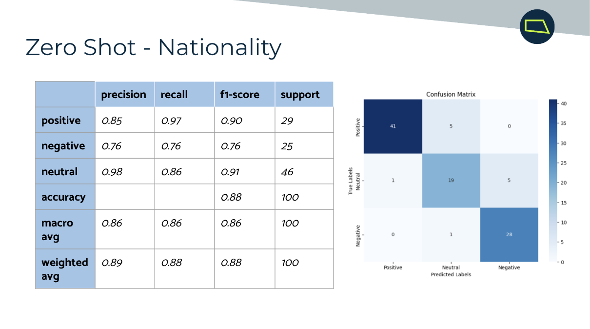

# Relativity 1D: Investigating the Potential Harms of Generative AI in the Justice System

---

## 1. Project Overview, Objectives, and Goals

### Overview
This project investigates the potential harms of generative AI in the justice system, particularly focusing on biases in frontier models. By examining how these biases manifest in the collection and analysis of text, photo, and audio evidence, we aim to ensure equitable outcomes in legal contexts.

### Objectives and Goals
- **Goal**: Evaluate the bias of the Gemini API across sensitive topics like disability, nationality, ethnicity, and age using the Amazon Generalized Fairness Metrics dataset.  
- **Impact**: Address systemic biases in industrial ML models that affect real-world decisions, mitigating risks that have historically skewed justice outcomes.  
- **Techniques**: Explore generic, zero-shot, and few-shot prompting to identify optimal bias detection strategies.

---

## 2. Methodology

### Data Preparation
1. Downloaded the dataset and removed duplicates or missing values.  
2. Created structured CSV files for efficient storage and analysis.  
3. Generated templated sentences for sensitive categories using the dataset.  

### Modeling & Evaluation
- Developed bias detection and sentiment analysis models.
- Compared zero-shot, few-shot, and generic prompting techniques.
- Used performance metrics like accuracy, F1-score, and precision-recall to evaluate model outcomes.

### Tools and Libraries
- Gemini API for sentiment analysis.  
- Amazon Generalized Fairness Metrics dataset.  
- Python libraries for data preprocessing and visualization.

---

## 3. Results and Key Findings

### Key Performance Metrics
- 
- 
- 
- 

### Insights
- Few-shot prompting outperformed other techniques, particularly for disability and ethnicity categories.
- Zero-shot prompting exceeded expectations but struggled with nuanced interpretation.  
- Models often overemphasized negative terms, impacting performance.

### Limitations
- Limited sample size per category due to resource constraints.
- Potential human bias in "true" sentiment labels.

---

## 4. Visualizations

- **Performance Comparisons**: Confusion matrices and precision-recall graphs for each prompting technique.  
- **Sentiment Analysis Examples**: Highlighted model disagreements and their rationale for true vs. predicted labels.  
- **Category Analysis**: Side-by-side comparison of results across different categories and techniques.

---

## 5. Potential Next Steps

- Extend analysis to more categories and modalities (e.g., images, speech).  
- Experiment with advanced prompting methods like Chain of Thought reasoning.  
- Upgrade resources (e.g., Gemini Pro) to increase sample size.  
- Investigate real-world applications beyond justice (e.g., credit screening, hiring).

---

## 6. Table of Contents

- [Project Overview](#1-project-overview-objectives-and-goals)  
- [Methodology](#2-methodology)  
- [Results and Key Findings](#3-results-and-key-findings)  
- [Visualizations](#4-visualizations)  
- [Potential Next Steps](#5-potential-next-steps)  
- [Installation](#7-installation)  
- [Usage](#8-usage)  
- [Contributing](#9-contributing)  
- [License](#10-license)  
- [Credits and Acknowledgments](#11-credits-and-acknowledgments)  

---

## 7. Installation

1. Clone the repository:  
   ```bash
   git clone https://github.com/example/repository.git](https://github.com/alishabose/Relativity-1D)

## 8. Usage

### Running the Analysis
- Create a Gemini API account in order to copy and paste our code
- Use your own secret key in the areas where it prompts for a key to run the API
- Upload all csvs and ensure they are named correctly in order for the output to run

## 8. Contributing
- Clone your forked repository locally: git clone https://github.com/alishabose/Relativity-1D
- Create a new branch for your feature or bug fix: git checkout -b feature-name
- Make your changes and commit them: git commit -m "Add feature for advanced bias detection"
- Push your branch to your forked repository: git push origin feature-name

## 9. License

Permission is hereby granted, free of charge, to any person obtaining a copy
of this software and associated documentation files (the "Software"), to deal
in the Software without restriction, including without limitation the rights
to use, copy, modify, merge, publish, distribute, sublicense, and/or sell
copies of the Software.

## 10. Credits and Acknowledgements

**Team Members**

   - *Lead* Alisha Bose (University of Washington)
   - *Lead* Tia Jain (UC Berkeley)
   - Amrit Randev (San Jose State University)
   - Jack Le (UT Dallas)

**Mentors**

   Michelle Hui (AI Studio TA)
   Piyush Ghai (Challenge Advisor, Relativity)

**Resources**

   Amazon Generalized Fairness Metrics dataset.
   Gemini API for bias detection.

Special thanks to Break Thru Tech and Relativity.
